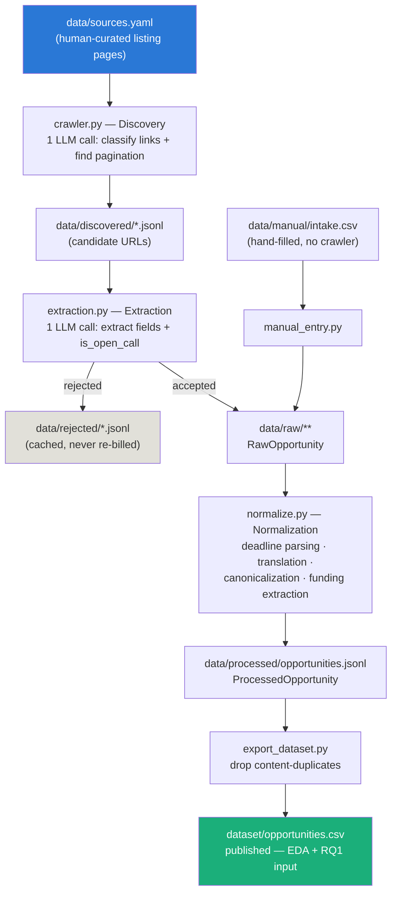
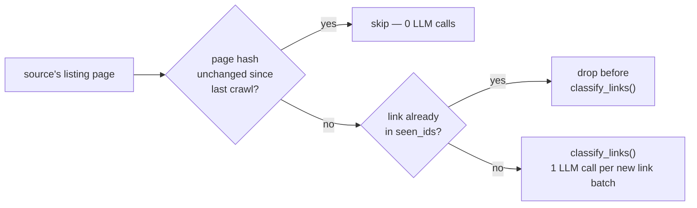

## CRAWLING → EXTRACTION → PROCESSING PIPELINE

One-command run: `uv run python scripts/run_pipeline.py`. Every stage
persists to JSONL merged by id (`sha256(source_url)`), so re-running only
spends on rows it hasn't seen — safe to interrupt and resume, never produces
duplicates. Full design rationale lives in `workflow.MD`; this is the
five-minute version.

### End-to-end flow



`data/` (raw/discovered/rejected/processed/manual) is its own nested,
gitignored local repo — none of it is published. `dataset/opportunities.csv`
is the one file this project actually ships.

### Stage by stage

| Stage | Script | Reads | Writes | LLM call? |
|---|---|---|---|---|
| Discovery | `src/collectors/crawler.py` | `sources.yaml` listing page | `data/discovered/` | Yes — classify harvested links as real opportunities vs. noise |
| Extraction | `src/collectors/extraction.py` | each discovered URL (HTML/PDF) | `data/raw/**` or `data/rejected/` | Yes — extract fields + accept/reject, `temperature=0` |
| Manual entry | `src/collectors/manual_entry.py` | `data/manual/intake.csv` | `data/raw/**` | No |
| Normalization | `src/processing/normalize.py` | `data/raw/**` | `data/processed/opportunities.jsonl` | Yes, only if source language ≠ English (translation) |
| Export | `scripts/export_dataset.py` | `data/processed/opportunities.jsonl` | `dataset/opportunities.csv` | No |

All LLM stages call `gpt-5.4-mini` via `client.chat.completions.parse()`
with a pydantic `response_format` — schema-constrained extraction/
classification/translation, not reasoning work.

### Why two LLM calls, not one

Discovery is deliberately **recall-oriented**: an ambiguous link (could be a
live call, could be retrospective news) gets kept rather than guessed away,
because that distinction usually isn't decidable from anchor text alone.
Extraction is where that ambiguity actually gets resolved — it reads the
whole fetched page, so it can tell a genuinely closed or non-eligibility
page apart from a real open call. Splitting the two steps keeps each
LLM call scoped to what it can actually see.

### Cost guards (why re-running is cheap)



- **Discovery**: a hash of each page's harvested candidate links (not raw
  HTML, so a stray timestamp/CSRF token can't trigger a false "changed") is
  cached in `data/discovered/_page_hashes.json` — an unchanged page skips
  the classify call entirely. Already-seen candidates are filtered out
  *before* classification too.
- **Extraction**: rejected URLs are cached in `data/rejected/` and never
  re-fetched; accepted ones are cached in `data/raw/**` by id. Force a
  re-check by deleting the specific cached line.
- **Normalization**: merges by id like every other stage — only rows not
  already in `data/processed/opportunities.jsonl` get (re-)translated.

### What normalization actually adds

`RawOpportunity` fields are carried through verbatim — normalization never
rewrites `requirements_text`/`title`, it only adds alongside them:

| Raw field | Processed additions |
|---|---|
| `deadline` (literal string) | `deadline_date` — parsed via `dateparser`, restricted to `[source_language, "en"]` to avoid cross-language misparses |
| `title`, `requirements_text`, `description` | `*_en` — machine-translated only if the source's declared language isn't English |
| `discipline`, `opportunity_type`, `career_stage`, `country` | `*_en` translation **and** `*_canonical` — mapped onto a fixed controlled vocabulary (list-valued; a source value can name several categories at once) |
| `city` | `city_en` only — no fixed vocabulary for an open field |
| `funding`, `application_fee` | structured extraction: `funding_components` (list of `{category, amount_min, amount_max, currency, period, note}`) and `application_fee_has_fee`/`_amount_min`/`_amount_max`/`_currency` |

Language is tagged **per source**, by hand, in `sources.yaml` — not
auto-detected — since each source's language was already confirmed while
curating it.

### Downstream of this pipeline

```
dataset/opportunities.csv ──► notebooks/eda.ipynb (Acts I–III)
                          ──► scripts/select_annotation_candidates.py ──► data/labels/candidate_chunks.csv
                                                                       ──► scripts/label_chunks.py ──► data/labels/eligibility_annotations.csv (RQ1 training data)
```
