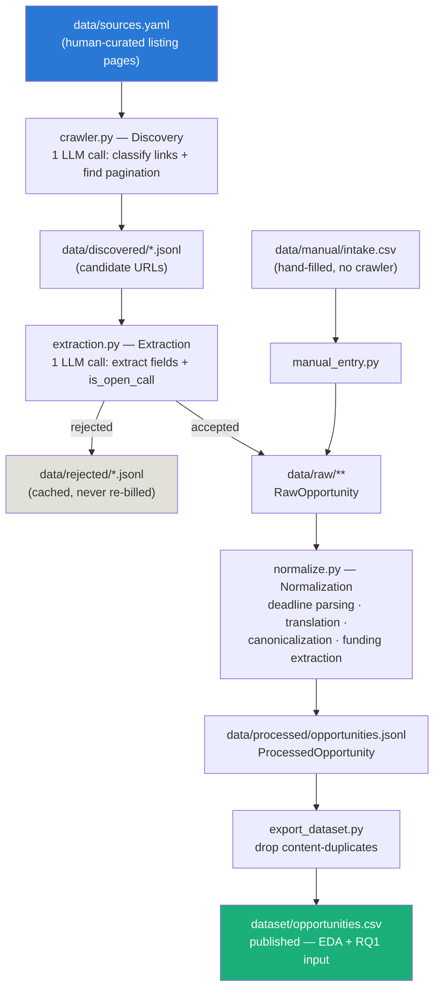
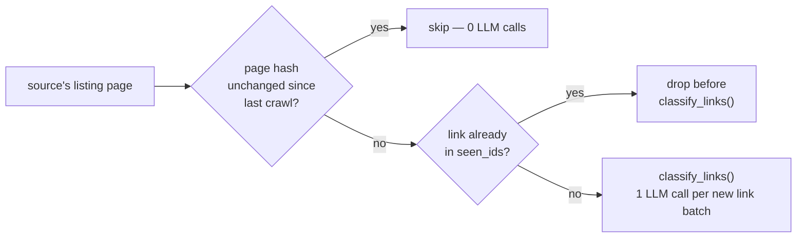
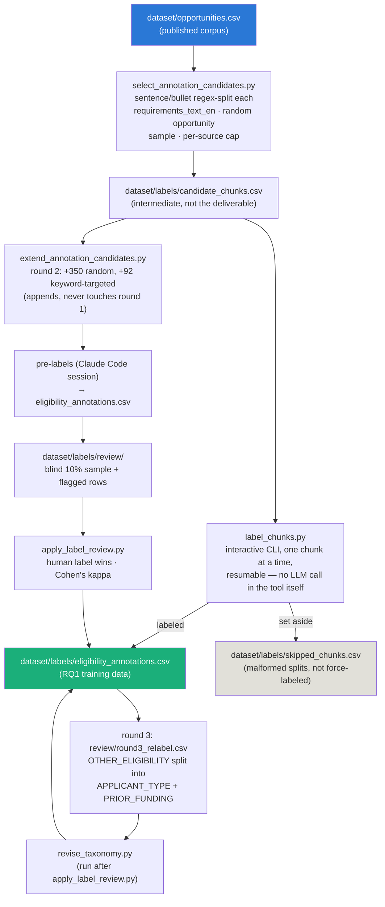
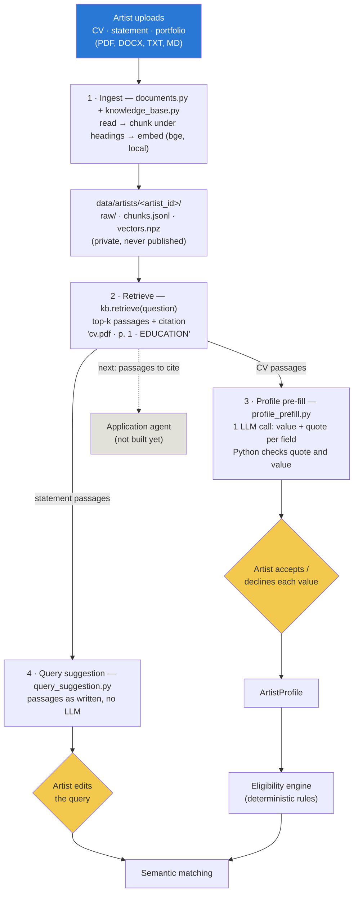
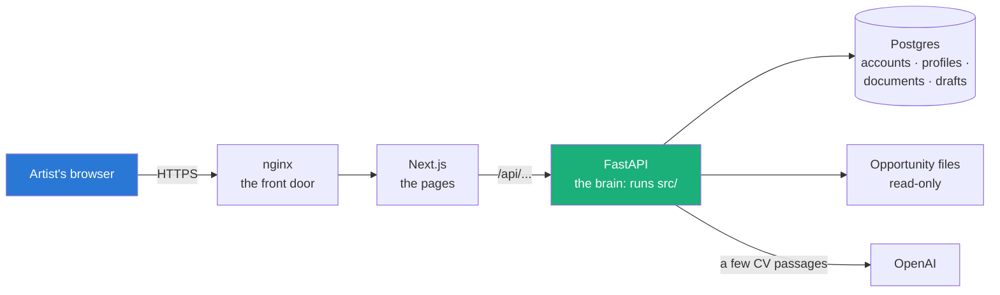
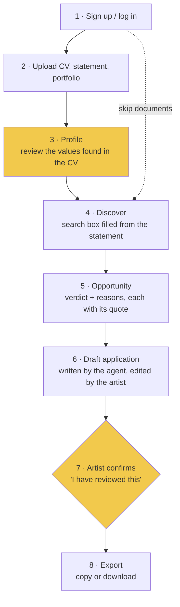

## CRAWLING → EXTRACTION → PROCESSING PIPELINE

One-command run: `uv run python scripts/run_pipeline.py`. Every stage
persists to JSONL merged by id (`sha256(source_url)`), so re-running only
spends on rows it hasn't seen — safe to interrupt and resume, never produces
duplicates. Full design rationale lives in `workflow.MD`; this is the
five-minute version.

### End-to-end flow


```mermaid
flowchart TD
    SRC["data/sources.yaml\n(human-curated listing pages)"]
    MAN["data/manual/intake.csv\n(hand-filled, no crawler)"]

    SRC --> CRAWL["crawler.py — Discovery\n1 LLM call: classify links + find pagination"]
    CRAWL --> DISC["data/discovered/*.jsonl\n(candidate URLs)"]
    DISC --> EXTR["extraction.py — Extraction\n1 LLM call: extract fields + is_open_call"]
    MAN --> MANUAL["manual_entry.py"]

    EXTR -- rejected --> REJ["data/rejected/*.jsonl\n(cached, never re-billed)"]
    EXTR -- accepted --> RAW["data/raw/**\nRawOpportunity"]
    MANUAL --> RAW

    RAW --> NORM["normalize.py — Normalization\ndeadline parsing · translation ·\ncanonicalization · funding extraction"]
    NORM --> PROC["data/processed/opportunities.jsonl\nProcessedOpportunity"]
    PROC --> EXPORT["export_dataset.py\ndrop content-duplicates"]
    EXPORT --> OUT["dataset/opportunities.csv\npublished — EDA + RQ1 input"]

    style SRC fill:#2a78d6,color:#fff
    style OUT fill:#1baf7a,color:#fff
    style REJ fill:#e1e0d9,color:#333
```

`data/` (raw/discovered/rejected/processed/manual) is its own nested,
gitignored local repo — none of it is published. `dataset/opportunities.csv`
is the one file this project actually ships.

### Stage by stage

| Stage | Script | Reads | Writes | LLM call? |
|---|---|---|---|---|
| Discovery | `src/collectors/crawler.py` | `sources.yaml` listing page | `data/discovered/` | Yes — classify harvested links as real opportunities vs. noise |
| Extraction | `src/collectors/extraction.py` | each discovered URL (HTML/PDF) | `data/raw/**` or `data/rejected/` | Yes — extract fields + accept/reject, `temperature=0` |
| Manual entry | `src/collectors/manual_entry.py` | `data/manual/intake.csv` | `data/raw/**` | No |
| Normalization | `src/processing/normalize.py` | `data/raw/**` | `data/processed/opportunities.jsonl` | Yes, only if source language ≠ English (translation) |
| Export | `scripts/export_dataset.py` | `data/processed/opportunities.jsonl` | `dataset/opportunities.csv` | No |

All LLM stages call `gpt-5.4-mini` via `client.chat.completions.parse()`
with a pydantic `response_format` — schema-constrained extraction/
classification/translation, not reasoning work.

### Why two LLM calls, not one

Discovery is deliberately **recall-oriented**: an ambiguous link (could be a
live call, could be retrospective news) gets kept rather than guessed away,
because that distinction usually isn't decidable from anchor text alone.
Extraction is where that ambiguity actually gets resolved — it reads the
whole fetched page, so it can tell a genuinely closed or non-eligibility
page apart from a real open call. Splitting the two steps keeps each
LLM call scoped to what it can actually see.

### Cost guards (why re-running is cheap)


```mermaid
flowchart LR
    P["source's listing page"] --> H{"page hash\nunchanged since\nlast crawl?"}
    H -- yes --> SKIP["skip — 0 LLM calls"]
    H -- no --> SEEN{"link already\nin seen_ids?"}
    SEEN -- yes --> DROP["drop before\nclassify_links()"]
    SEEN -- no --> CLASSIFY["classify_links()\n1 LLM call per new link batch"]
```

- **Discovery**: a hash of each page's harvested candidate links (not raw
  HTML, so a stray timestamp/CSRF token can't trigger a false "changed") is
  cached in `data/discovered/_page_hashes.json` — an unchanged page skips
  the classify call entirely. Already-seen candidates are filtered out
  *before* classification too.
- **Extraction**: rejected URLs are cached in `data/rejected/` and never
  re-fetched; accepted ones are cached in `data/raw/**` by id. Force a
  re-check by deleting the specific cached line.
- **Normalization**: merges by id like every other stage — only rows not
  already in `data/processed/opportunities.jsonl` get (re-)translated.

### What normalization actually adds

`RawOpportunity` fields are carried through verbatim — normalization never
rewrites `requirements_text`/`title`, it only adds alongside them:

| Raw field | Processed additions |
|---|---|
| `deadline` (literal string) | `deadline_date` — parsed via `dateparser`, restricted to `[source_language, "en"]` to avoid cross-language misparses |
| `title`, `requirements_text`, `description` | `*_en` — machine-translated only if the source's declared language isn't English |
| `discipline`, `opportunity_type`, `career_stage`, `country` | `*_en` translation **and** `*_canonical` — mapped onto a fixed controlled vocabulary (list-valued; a source value can name several categories at once) |
| `city` | `city_en` only — no fixed vocabulary for an open field |
| `funding`, `application_fee` | structured extraction: `funding_components` (list of `{category, amount_min, amount_max, currency, period, note}`) and `application_fee_has_fee`/`_amount_min`/`_amount_max`/`_currency` |

Language is tagged **per source**, by hand, in `sources.yaml` — not
auto-detected — since each source's language was already confirmed while
curating it.

### Downstream of this pipeline

```
dataset/opportunities.csv ──► notebooks/eda.ipynb (Acts I–III)
                          ──► scripts/select_annotation_candidates.py ──► data/labels/candidate_chunks.csv
                                                                       ──► scripts/label_chunks.py ──► data/labels/eligibility_annotations.csv (RQ1 training data)
```


## Annotation flow

Two scripts, no LLM call baked into either — this is regex-based chunking
plus a plain CLI labeling loop. Full taxonomy, edge-case rules and the
decision log live in `ANNOTATION_GUIDELINES.md`; this is the five-minute
version.

### End-to-end flow


```mermaid
flowchart TD
    OUT["dataset/opportunities.csv\n(published corpus)"]
    OUT --> SEL["select_annotation_candidates.py\nsentence/bullet regex-split each\nrequirements_text_en · random opportunity\nsample · per-source cap"]
    SEL --> CAND["dataset/labels/candidate_chunks.csv\n(intermediate, not the deliverable)"]
    CAND --> LAB["label_chunks.py\ninteractive CLI, one chunk at a time,\nresumable — no LLM call in the tool itself"]
    LAB -- labeled --> ANN["dataset/labels/eligibility_annotations.csv\n(RQ1 training data)"]
    LAB -- set aside --> SKIP["dataset/labels/skipped_chunks.csv\n(malformed splits, not force-labeled)"]
    CAND --> EXT["extend_annotation_candidates.py\nround 2: +350 random, +92 keyword-targeted\n(appends, never touches round 1)"]
    EXT --> PRE["pre-labels (Claude Code session)\n→ eligibility_annotations.csv"]
    PRE --> REV["dataset/labels/review/\nblind 10% sample + flagged rows"]
    REV --> APPLY["apply_label_review.py\nhuman label wins · Cohen's kappa"]
    APPLY --> ANN
    ANN --> R3["round 3: review/round3_relabel.csv\nOTHER_ELIGIBILITY split into\nAPPLICANT_TYPE + PRIOR_FUNDING"]
    R3 --> TAX["revise_taxonomy.py\n(run after apply_label_review.py)"]
    TAX --> ANN

    style OUT fill:#2a78d6,color:#fff
    style ANN fill:#1baf7a,color:#fff
    style SKIP fill:#e1e0d9,color:#333
```

### Stage by stage

| Stage | Script | Reads | Writes | LLM call? |
|---|---|---|---|---|
| Candidate selection | `scripts/select_annotation_candidates.py` | `dataset/opportunities.csv` | `dataset/labels/candidate_chunks.csv` | No — regex sentence/bullet splitting, then whole opportunities sampled at random (never cherry-picked) with a per-source cap |
| Labeling | `scripts/label_chunks.py` | `dataset/labels/candidate_chunks.csv` | `dataset/labels/eligibility_annotations.csv`, `dataset/labels/skipped_chunks.csv` | No — a plain CLI prompt against the 11-class taxonomy (9 before round 3); the labels themselves were applied by a human/Claude Code session following `ANNOTATION_GUIDELINES.md`, not generated by a model call |

### Round 2: from 292 to 678 labeled rows

Added because the learning curve showed the embeddings model still
improving with more data (see "Would more annotated data help?" below).
Two batches, tagged in `candidate_chunks.csv`'s `batch` column:
**random** (350 chunks, 76 whole opportunities — same method as round 1,
keeps the class mix realistic) and **targeted** (92 chunks keyword-matched
to the thin classes). Labeled by a Claude Code session against the
guidelines — 386 rows after splits, 100 set aside (form-field residue,
untranslated text, broken splits) — then reviewed by the human annotator:

- **Blind sample** (`review/round2_blind.csv`): a random 10%, pre-label
  hidden, labeled from scratch → **measured human-vs-LLM agreement
  (Cohen's kappa)**. This puts a number on label quality and on the
  "agreement bias" caveat of the LLM reference model.
- **Flagged rows** (`review/round2_flagged.csv`): every pre-label the
  session marked uncertain, with its reason.

`scripts/apply_label_review.py` applies the decisions (human always
wins) and saves the agreement to `review/round2_agreement.json`;
`scripts/review_labels.py` is the CLI used to fill the two files.

**Result: Cohen's kappa 0.675 (74.4% raw agreement)** on the blind
sample — "substantial" agreement. The 10 disagreements cluster on the
boundaries the guidelines already call hard (EDUCATION / STUDENT_STATUS
/ CAREER_STAGE, organisation type vs. RESIDENCE). Nine reviewer answers
that contradicted a written rule were adjudicated back to the rule
(`review/round2_adjudication.csv`); kappa is computed *before* that
step, on the reviewer's original answers. Full rules, patterns and the
EDUCATION finding: `ANNOTATION_GUIDELINES.md` §6.

### Round 3: taxonomy revision, 9 → 11 classes

Motivated by the per-class results, not by the learning curve: the
well-defined classes scored 0.75–0.92 F1, and the errors sat in the two
classes defined by exclusion — `OTHER_ELIGIBILITY` (20% of chunks,
0.62 F1) and `NONE` (0.70). Reading all 137 `OTHER_ELIGIBILITY` chunks
showed two recurring concepts inside it, now classes of their own:

- **`APPLICANT_TYPE`** — individual vs. organisation, legal form,
  organisation category, duo/collective (76 chunks). Also the gate the
  eligibility engine needs first.
- **`PRIOR_FUNDING`** — previous or current grants, rejections, prior
  participation, award caps (32 chunks).

What's left in `OTHER_ELIGIBILITY` (32, 4.6%) is genuinely
miscellaneous. `NONE` got a one-question test: *does the sentence
exclude anyone from applying?* Every decision is a row in
`review/round3_relabel.csv` (chunk_id, new_label, reason), applied by
`scripts/revise_taxonomy.py`; earlier annotator notes were re-read
first and overruled 4 of the proposed changes.

A targeted top-up (`extend_annotation_candidates.py --round 3`) found
**no** new `EDUCATION` candidates — only 17 degree-wording sentences
exist in the whole corpus, all already labeled — and 24 `PRIOR_FUNDING`
candidates, of which 9 were near-identical copies of one source's
boilerplate and were set aside so identical text can't sit on both
sides of a CV split.

**Review:** `review/round3_blind.csv` (34 rows, pre-label hidden) and
`review/round3_flagged.csv` (38 judgement calls), via `review_labels.py
--round 3` then `apply_label_review.py --round 3`. **Result: Cohen's
kappa 0.590** (64.7% raw), below round 2's 0.675, so the plan's
"kappa must rise" gate was not met. 6 of the 12 disagreements are about
organisation types (APPLICANT_TYPE vs RESIDENCE / DISCIPLINE). 8
answers that contradicted a written rule were adjudicated back to it
(`review/round3_adjudication.csv`), after the product owner chose to
keep the org-descriptor and fused-field rules. Details:
`ANNOTATION_GUIDELINES.md` §6, 2026-09-30.

### Why sample whole opportunities, not chunks directly

Selecting whole opportunities at random and taking every sentence from
each — rather than hand-picking "eligibility-looking" chunks — keeps
`NONE` naturally represented instead of silently under-sampled, and
matches how a classifier will actually see text at inference (a full
call's sentences, not pre-filtered ones). The per-source cap (18% of
target, recomputed live against the current corpus each run rather than
trusting a stale percentage) stops one prolific source's boilerplate
phrasing from dominating the labeled sample — same reasoning as
`workflow.MD`'s corpus-imbalance note, applied at sampling time.

### Result

**696 labeled chunks across 231 opportunities** after three rounds, 11
classes (EDUCATION 15 … NONE 204) —
`dataset/labels/eligibility_annotations.csv`, the training data for the
eligibility classifier. Round 2 ended at 678 chunks / 9 classes. Round 1, below, produced the first 292 (79
opportunities). 3 opportunities with a
broken `requirements_text` were excluded before chunking (§0); 27 chunks
sit in `skipped_chunks.csv` instead of being force-labeled — 17 malformed
splits set aside during labeling, plus 10 bare section headings ("Who can
apply?", "Eligible applicants") removed after the baseline showed them
teaching the model that eligibility vocabulary means `NONE`
(`ANNOTATION_GUIDELINES.md` §6, 2026-09-29). A model-assisted label audit
of the baseline's top-30 confident errors changed 4 labels (same §6).


## Eligibility classifier (RQ1)

`notebooks/eligibility_classifier.ipynb`. Validation is 5-fold
`StratifiedGroupKFold` grouped by `opportunity_id`: stratified because
the 11 classes are imbalanced (15–204), grouped because chunks from the
same call share phrasing and would otherwise leak across train/test.
Every model is compared on these same folds, macro-F1 as the headline
metric.

**Current numbers (round 3: 696 rows, 11 classes, reviewed).** Headline
= **mean ± std over 10 fold seeds**, since a single split proved unstable
(below). The "9 classes" column merges the two new classes back into
`OTHER_ELIGIBILITY`, for comparison with earlier rounds.

| Model | Macro-F1, 11 classes | Macro-F1, 9 classes | Accuracy |
|---|---|---|---|
| TF-IDF + LogReg (baseline) | 0.650 ± 0.016 | 0.693 | 0.69 |
| TF-IDF + Linear SVM | 0.646 ± 0.016 | 0.696 | 0.68 |
| **Embeddings (`bge-base`) + LogReg — chosen** | **0.701 ± 0.012** | **0.747** | **0.74** |
| Embeddings (`bge-large`) + LogReg | 0.708 ± 0.010 | 0.755 | 0.74 |
| OpenAI LLM, few-shot (reference, seed 42 only) | 0.755 | 0.801 | 0.75 |

### What round 3 changed

- **Scores: essentially nothing.** Same 678 chunks, same folds, 10
  seeds: round-2 labels 0.743 ± 0.009 vs round-3 labels 0.737 ± 0.011
  (bge-base, 9-class view). An earlier single-split reading showed
  +0.025; that was split luck, not a gain.
- **Usefulness: yes.** The eligibility engine gets applicant type and
  prior funding as separate signals (0.64 / 0.73 F1). The catch-all
  shrank from 20% to 4% of chunks; its remainder is heterogeneous by
  design and stays the weakest class.
- **Context didn't help** (previous sentence or heading, as text or as
  a vector: always below the chunk alone).
- **bge-large: +0.007 macro-F1**, within about one std, for a ~6×
  larger model file (1.34 GB vs 0.22 GB). bge-base stays the product
  model.
- **Confidence threshold** 0.7: 67% of chunks auto-accepted at 85%
  accuracy, 33% routed to the artist.
- **Evaluation lesson — key presentation point.** One fold split is not
  a stable measurement at ~700 chunks. `StratifiedGroupKFold` assigns
  folds using the labels, so 13 label edits reshuffled most folds and
  moved the score by ~0.02 on their own. Seed 42 was also ~0.03 more
  favourable than the average seed. Decisions taken on it looked
  better than they were. The notebook now reports every trained model
  over 10 seeds.

**Round 2 numbers (678 rows, 9 classes)**, kept for the history; round-1
(292 rows) in brackets, because the change between the two is itself a
finding.

| Model | Mean CV macro-F1 | Notes |
|---|---|---|
| TF-IDF + Logistic Regression (baseline) | 0.707 *(0.625)* | `class_weight='balanced'`, `GridSearchCV` over `C`, n-gram range, `min_df`; best C=1, unigrams, min_df=1 |
| TF-IDF + Linear SVM | 0.681 *(0.643)* | same TF-IDF grid, best C=0.1. **Now below the baseline** on all 5 folds — its round-1 edge did not survive more data |
| **Sentence embeddings (`bge-base-en-v1.5`) + LogReg** | **0.740** *(0.723)* | frozen embeddings via `fastembed`, best C=10. Best trained model; beats the baseline on 4 of 5 folds. LogReg kept over LinearSVC on the embeddings (0.740 vs 0.722, ahead on 3 of 5 folds): isolates the representation change, and gives probabilities for routing low-confidence labels to human review |
| OpenAI LLM, few-shot (reference only, not a product candidate) | 0.767 *(0.766)* | `gpt-5.4-mini`, temperature 0, taxonomy in the prompt + 2 examples per label drawn from each fold's *training* chunks only; answers cached in `notebooks/cache/llm_predictions.jsonl`. Gap to the embeddings model narrowed from 0.043 to 0.027, and the embeddings model now wins 3 of 5 folds against it |

### What round 2 changed

- **Every trained model improved, TF-IDF the most** (+0.08, vs +0.02 for
  embeddings) — exactly the learning curve's prediction: TF-IDF only
  knows words it has seen, so it's the model most starved for data.
- **The SVM's round-1 win was small-sample noise.** At 292 rows it beat
  the baseline on all 5 folds by +0.018; at 678 it loses on all 5. A
  consistent win on ~60-chunk test folds was still not a robust one —
  worth saying in the presentation as a lesson about small evaluations.
  (Its best C also moved from the grid edge, where the classes were
  trivially separable, to 0.1: with more data, regularisation matters.)
- **Embeddings are still the best trained model, by a smaller margin**
  (+0.033 over the baseline instead of +0.098): the representation
  matters most when data is scarce.
- **Smaller gain than the round-1 learning curve suggested** (+0.017
  where "a few points" was projected). The two sets aren't like for
  like — round 2 added 138 new opportunities and a targeted batch aimed
  at hard boundary cases — and the labels themselves set a ceiling: the
  blind review found ~26% disagreement between the pre-labels and the
  human reviewer on round-2 chunks, and the best model's accuracy (72%) is already
  close to that level of label consistency. More data alone won't push
  much further; clearer class boundaries would.

### Final model

The chosen model (refit 2026-09-30, round 3: bge-base + LogReg, C=100,
11 classes) is refit on all 696 chunks and saved to
`artifacts/eligibility_classifier.joblib`, with a metadata file
(`eligibility_classifier.json`) recording the embedding model it
expects and its CV score. Its expected quality is the 10-seed CV
estimate (0.701 ± 0.012 macro-F1, 11 classes; 0.747 on the original 9). The product embeds each chunk with the same
`bge-base-en-v1.5` model, and the classifier returns a label plus
probabilities, so low-confidence labels can go to human review. Details:
`workflow.MD`, "Final model artifact".

### Why the baseline scores low — known limitations

The densest error cluster is `NONE` ↔ `DISCIPLINE`. Once the heading
artifacts were removed, what's left comes from two things bag-of-words
TF-IDF structurally can't handle, not from labeling or tuning:

1. **Arts vocabulary in non-constraint sentences.** Project and delivery
   descriptions ("you will work with … arts, cultural or creative
   organisations", "we welcome experimental forms … art and high
   culture") are `NONE`, but they're full of the same words as real
   `DISCIPLINE` constraints. TF-IDF counts words; it can't tell "the
   project involves X" from "the applicant must be X".
2. **Discipline terms too rare to learn.** Real `DISCIPLINE` chunks
   name specific practices ("early music", "dancers and circus
   artists", "costume designers", "translators") that each appear once
   or twice in round 1's 292 chunks. TF-IDF has no notion that "dancers",
   "performers" and "choreographic" are related, so an unseen term
   carries no signal and the chunk falls to `NONE`.

Both are the motivation for the sentence-embedding classifier (and its results bear the diagnosis out — see the table):
embeddings put related practices near each other and encode sentence
structure better than word counts. Deliberately not patched with
hand-built TF-IDF extras — bigrams were already in the grid search and
lost to unigrams, and a hand-curated discipline lexicon would be effort
spent on a model the embedding classifier is expected to replace.

### Would more annotated data help? — learning curve

Last cell of the notebook: each fold's model retrained on 25/50/75/100% of
its training *opportunities* (5 random draws per share), scored on the
untouched test fold.

| Training chunks (avg) | ~143 | ~277 | ~407 | ~542 |
|---|---|---|---|---|
| TF-IDF + LogReg | 0.50 | 0.61 | 0.67 | 0.71 |
| Embeddings + LogReg | 0.61 | 0.68 | 0.72 | 0.74 |

*(On the final 678-row set. On round 1's 292 rows the same curve read
0.50 → 0.61 → 0.70 → 0.72 for embeddings and 0.29 → 0.43 → 0.55 → 0.63
for TF-IDF — which is what motivated round 2.)*

- **Embeddings need far less data than TF-IDF:** with half the chunks
  (~277) they match TF-IDF trained on all of them (0.68 vs 0.71 is
  within one fold's spread), and the gap is widest at the smallest
  size. The pretrained model already knows the language; TF-IDF only
  knows words it has seen. Good presentation point.
- **The embeddings curve is flattening** (+0.07, +0.04, +0.02 per
  quarter): the model is close to what this label set can support —
  see "What round 2 changed".

### Why model 4 is in the comparison — key presentation point

> **1. It answers the obvious question about RQ1: "why not just call an
> LLM?"** Any NLP project today gets asked this. Without model 4 the
> answer is an argument; with it, it's a measurement: **a local model
> that costs nothing per call and always gives the same answer gets
> within ~0.03 macro-F1 of a hosted LLM** (0.740 vs 0.767), and beats
> it on 3 of the 5 folds — and the LLM needed no training data to get
> there.
>
> **2. It turns design decisions into a measured trade-off.** 
> Model 4 puts a number on what those principles cost: **give up ~0.03
> F1, get determinism, zero per-call cost and local execution.** A
> stated preference becomes an evidence-based choice.


### Embedding runtime

Embeddings run on `fastembed` (ONNX Runtime), not `sentence-transformers`
(PyTorch): PyTorch has no build for the Intel-Mac dev machine on Python
3.13, and downgrading Python would have pinned the whole project to
NumPy 1.x and a frozen 2024 torch. Same model weights, same vectors,
smaller deployment footprint, reusable for matching/RAG. Full decision
record, including the alternatives rejected: `workflow.MD`,
"Embedding runtime: fastembed, not PyTorch".

## RAG — artist knowledge base

The artist uploads their CV, statement and portfolio. These are split into
short passages and embedded locally. Each later use retrieves only the few
passages it needs, and every value or text it produces shows the passage it
came from. Nothing produced here is used until the artist has reviewed it.
Code: `src/rag/`. The full design rationale and the evaluation numbers are
in `workflow.MD`, "RAG — artist knowledge base".

### End-to-end flow


```mermaid
flowchart TD
    UP["Artist uploads\nCV · statement · portfolio\n(PDF, DOCX, TXT, MD)"]

    UP --> ING["1 · Ingest — documents.py + knowledge_base.py\nread → chunk under headings → embed (bge, local)"]
    ING --> KB["data/artists/&lt;artist_id&gt;/\nraw/ · chunks.jsonl · vectors.npz\n(private, never published)"]

    KB --> RET["2 · Retrieve — kb.retrieve(question)\ntop-k passages + citation\n'cv.pdf · p. 1 · EDUCATION'"]

    RET -- "CV passages" --> PRE["3 · Profile pre-fill — profile_prefill.py\n1 LLM call: value + quote per field\nPython checks quote and value"]
    RET -- "statement passages" --> QRY["4 · Query suggestion — query_suggestion.py\npassages as written, no LLM"]

    PRE --> REV1{"Artist accepts /\ndeclines each value"}
    REV1 --> PROF["ArtistProfile"]
    QRY --> REV2{"Artist edits\nthe query"}

    PROF --> ENG["Eligibility engine\n(deterministic rules)"]
    REV2 --> MATCH["Semantic matching"]
    ENG --> MATCH

    RET -. "next: passages to cite" .-> AGENT["Application agent\n(not built yet)"]

    style UP fill:#2a78d6,color:#fff
    style REV1 fill:#f2c94c,color:#333
    style REV2 fill:#f2c94c,color:#333
    style AGENT fill:#e1e0d9,color:#333
```

### Step by step

| Step | Code | What it does | LLM call? |
|---|---|---|---|
| 1 · Ingest | `documents.py`, `knowledge_base.py` | Reads the file. Splits it into passages of at most 800 characters that never cross a section heading, so "2019 MFA" stays under *Education*. Embeds each passage with `bge-base`, the same model as matching and RQ1. | No |
| 2 · Retrieve | `kb.retrieve()` | Embeds the question and returns the closest passages, each with file, page and section. It can be limited to some files, e.g. only the CV. | No |
| 3 · Profile pre-fill | `profile_prefill.py` | Five short queries collect 5–6 CV passages. One call proposes profile values (birth date, nationality, residence, degree…), each with a quote. Python drops any proposal whose quote isn't in the passage or whose value the profile's rules refuse. | Yes, one per pre-fill |
| 4 · Query suggestion | `query_suggestion.py` | Fills the matching search box with the statement passages about the practice, as written. | No |

### Why it is built this way

- **The artist confirms everything.** Pre-filled values are proposals,
  shown with their quote. Only the ones the artist accepts reach the
  profile, and the eligibility engine never sees an unreviewed value. The
  suggested query is only a starting text for the search box.
- **Only a few passages leave the machine.** Steps 1, 2 and 4 run locally.
  Step 3 sends OpenAI only the 5–6 retrieved CV passages, never a whole
  document. Uploaded files are stored in the private `data/` repo.
- **The LLM is used only where it is needed.** Turning "Citizenship:
  Hungarian" into `nationalities=["HU"]` needs language understanding, so
  step 3 uses an LLM. In step 4 an LLM-written query ranked no better than
  the artist's own sentences, so step 4 does without one.
- **The checks catch invented evidence, not every mistake.** The quote
  check proves the quote exists, not that it supports the value. The artist
  seeing the quote is the final safeguard.
- **Uploads are untrusted.** Four file types only, size caps, and a clear
  error message instead of a crash. The prompt treats passages as data,
  never as instructions.

### Result on the two fictional personas

| | |
|---|---|
| Retrieval, CV only, field-style queries | the right section was in the top 3 for 12/12 queries |
| Profile pre-fill | of 20 fields: 18 filled correctly, 2 correctly left empty, 0 wrong (last 2 runs) |
| Query suggestion | statement passages 5/10 and 9/10 relevant in the top 10, vs. 3/10 and 8/10 for an LLM-written query |

The personas are invented (`scripts/make_example_artists.py`), and these
are sanity checks, not benchmarks.

## The web app (2026-10-08)

The website artists use. It puts matching, eligibility and RAG behind one
login, and later the application agent too. This is the short version; the
full plan, with the reasons behind each choice, is in `workflow.MD`,
"Web app — plan".

### What runs where


```mermaid
flowchart LR
    B["Artist's browser"] -- "HTTPS" --> N["nginx\nthe front door"]
    N --> W["Next.js\nthe pages"]
    W -- "/api/..." --> A["FastAPI\nthe brain: runs src/"]
    A --> P[("Postgres\naccounts · profiles ·\ndocuments · drafts")]
    A --> F["Opportunity files\nread-only"]
    A -- "a few CV passages" --> O["OpenAI"]

    style B fill:#2a78d6,color:#fff
    style A fill:#1baf7a,color:#fff
```

| Piece | Job | Built with |
|---|---|---|
| nginx | Receives every visit, handles HTTPS | Already on the VPS, certificate from certbot |
| Next.js | Draws the pages. Holds no data and no secrets. | TypeScript, plain CSS Modules, native HTML elements |
| FastAPI | Does all the work: login, uploads, profile, matching, eligibility, drafts | Python, calling the existing `src/` code |
| Postgres | Remembers everything that belongs to an artist | Postgres + pgvector (for the CV passages' embeddings) |
| Opportunity files | The 479 calls, their search index and their eligibility sentences | The files the pipeline already produces |

Everything runs on the VPS at **https://open-art.lucadev.org**. Only
nginx can be reached from the internet; every other piece listens on the
server itself only.

### The artist's journey


```mermaid
flowchart TD
    S["1 · Sign up / log in"] --> D["2 · Upload CV, statement, portfolio"]
    D --> PR["3 · Profile\nreview the values found in the CV"]
    PR --> DI["4 · Discover\nsearch box filled from the statement"]
    DI --> OP["5 · Opportunity\nverdict + reasons, each with its quote"]
    OP --> DR["6 · Draft application\nwritten by the agent, edited by the artist"]
    DR --> C{"7 · Artist confirms\n'I have reviewed this'"}
    C --> EX["8 · Export\ncopy or download"]

    S -. "skip documents" .-> DI

    style C fill:#f2c94c,color:#333
    style PR fill:#f2c94c,color:#333
```

Yellow = the artist decides. Nothing found in a CV reaches the profile
until the artist accepts it, and no draft can be exported until the artist
confirms it. **The app never sends an application anywhere**: the artist
submits it themselves.

### Screens

| Screen | What the artist does there |
|---|---|
| Landing | Learns what OpenArt does |
| Sign up / Log in | Gets in |
| Documents | Uploads and deletes CV, statement, portfolio |
| Profile | Accepts or declines each value found in the CV, fills in the rest by hand |
| Discover | Searches calls, with type filters next to the search box |
| Opportunity | Reads the call and why they are or may not be eligible |
| Draft | Edits the draft application, confirms it, exports it |
| My drafts | Sees all drafts and their status |
| Account | Changes password, or deletes the account and all its data |

### Why it is built this way

- **Python where the logic already is.** The matching, eligibility and RAG
  code is Python, so the API is Python too and calls it directly. Next only
  shows pages.
- **Postgres, not files, for artists' data.** Many artists at once, data
  that must survive restarts and be fully deletable, and a database
  already installed on the server.
- **Accessible without a library.** Real forms, labels, buttons and the
  browser's own `<dialog>` give keyboard and screen-reader support for
  free.
- **Safe by default on a shared server.** Passwords hashed, private
  session cookie, each artist sees only their own data, and nothing but
  nginx is reachable from outside.

### Build order

1. Empty app online with HTTPS (live)
2. Database and login (built)
3. Documents
4. Profile
5. Discover and opportunity pages
6. Application agent and drafts
7. Accessibility and security check
