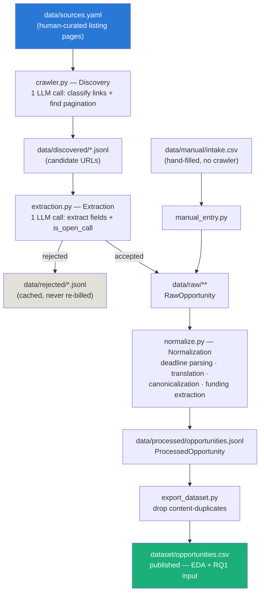
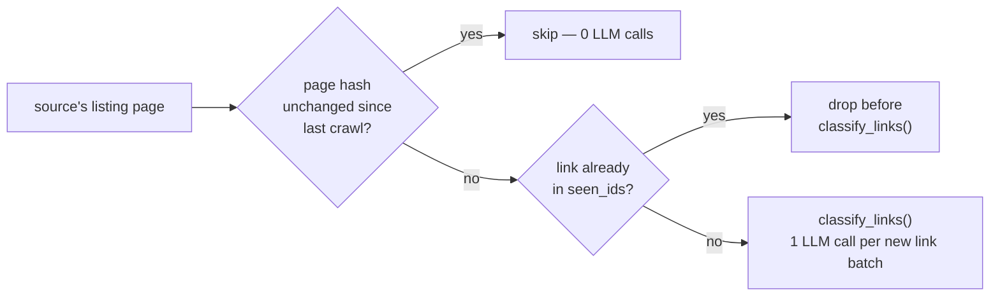
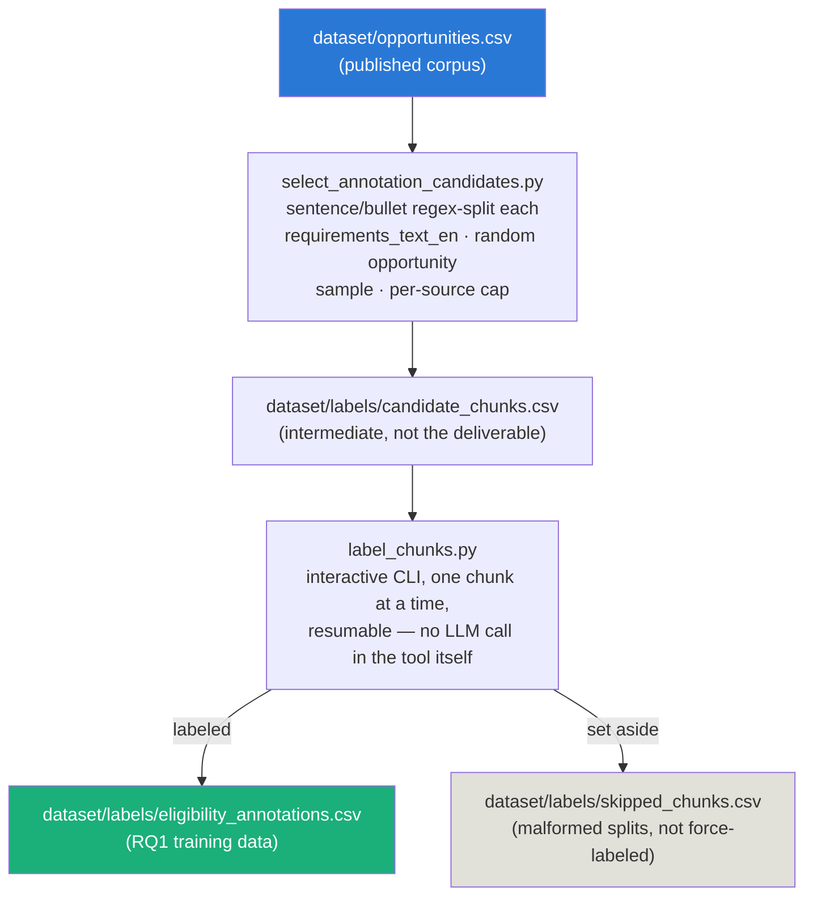

## CRAWLING → EXTRACTION → PROCESSING PIPELINE

One-command run: `uv run python scripts/run_pipeline.py`. Every stage
persists to JSONL merged by id (`sha256(source_url)`), so re-running only
spends on rows it hasn't seen — safe to interrupt and resume, never produces
duplicates. Full design rationale lives in `workflow.MD`; this is the
five-minute version.

### End-to-end flow


```mermaid
flowchart TD
    SRC["data/sources.yaml\n(human-curated listing pages)"]
    MAN["data/manual/intake.csv\n(hand-filled, no crawler)"]

    SRC --> CRAWL["crawler.py — Discovery\n1 LLM call: classify links + find pagination"]
    CRAWL --> DISC["data/discovered/*.jsonl\n(candidate URLs)"]
    DISC --> EXTR["extraction.py — Extraction\n1 LLM call: extract fields + is_open_call"]
    MAN --> MANUAL["manual_entry.py"]

    EXTR -- rejected --> REJ["data/rejected/*.jsonl\n(cached, never re-billed)"]
    EXTR -- accepted --> RAW["data/raw/**\nRawOpportunity"]
    MANUAL --> RAW

    RAW --> NORM["normalize.py — Normalization\ndeadline parsing · translation ·\ncanonicalization · funding extraction"]
    NORM --> PROC["data/processed/opportunities.jsonl\nProcessedOpportunity"]
    PROC --> EXPORT["export_dataset.py\ndrop content-duplicates"]
    EXPORT --> OUT["dataset/opportunities.csv\npublished — EDA + RQ1 input"]

    style SRC fill:#2a78d6,color:#fff
    style OUT fill:#1baf7a,color:#fff
    style REJ fill:#e1e0d9,color:#333
```

`data/` (raw/discovered/rejected/processed/manual) is its own nested,
gitignored local repo — none of it is published. `dataset/opportunities.csv`
is the one file this project actually ships.

### Stage by stage

| Stage | Script | Reads | Writes | LLM call? |
|---|---|---|---|---|
| Discovery | `src/collectors/crawler.py` | `sources.yaml` listing page | `data/discovered/` | Yes — classify harvested links as real opportunities vs. noise |
| Extraction | `src/collectors/extraction.py` | each discovered URL (HTML/PDF) | `data/raw/**` or `data/rejected/` | Yes — extract fields + accept/reject, `temperature=0` |
| Manual entry | `src/collectors/manual_entry.py` | `data/manual/intake.csv` | `data/raw/**` | No |
| Normalization | `src/processing/normalize.py` | `data/raw/**` | `data/processed/opportunities.jsonl` | Yes, only if source language ≠ English (translation) |
| Export | `scripts/export_dataset.py` | `data/processed/opportunities.jsonl` | `dataset/opportunities.csv` | No |

All LLM stages call `gpt-5.4-mini` via `client.chat.completions.parse()`
with a pydantic `response_format` — schema-constrained extraction/
classification/translation, not reasoning work.

### Why two LLM calls, not one

Discovery is deliberately **recall-oriented**: an ambiguous link (could be a
live call, could be retrospective news) gets kept rather than guessed away,
because that distinction usually isn't decidable from anchor text alone.
Extraction is where that ambiguity actually gets resolved — it reads the
whole fetched page, so it can tell a genuinely closed or non-eligibility
page apart from a real open call. Splitting the two steps keeps each
LLM call scoped to what it can actually see.

### Cost guards (why re-running is cheap)


```mermaid
flowchart LR
    P["source's listing page"] --> H{"page hash\nunchanged since\nlast crawl?"}
    H -- yes --> SKIP["skip — 0 LLM calls"]
    H -- no --> SEEN{"link already\nin seen_ids?"}
    SEEN -- yes --> DROP["drop before\nclassify_links()"]
    SEEN -- no --> CLASSIFY["classify_links()\n1 LLM call per new link batch"]
```

- **Discovery**: a hash of each page's harvested candidate links (not raw
  HTML, so a stray timestamp/CSRF token can't trigger a false "changed") is
  cached in `data/discovered/_page_hashes.json` — an unchanged page skips
  the classify call entirely. Already-seen candidates are filtered out
  *before* classification too.
- **Extraction**: rejected URLs are cached in `data/rejected/` and never
  re-fetched; accepted ones are cached in `data/raw/**` by id. Force a
  re-check by deleting the specific cached line.
- **Normalization**: merges by id like every other stage — only rows not
  already in `data/processed/opportunities.jsonl` get (re-)translated.

### What normalization actually adds

`RawOpportunity` fields are carried through verbatim — normalization never
rewrites `requirements_text`/`title`, it only adds alongside them:

| Raw field | Processed additions |
|---|---|
| `deadline` (literal string) | `deadline_date` — parsed via `dateparser`, restricted to `[source_language, "en"]` to avoid cross-language misparses |
| `title`, `requirements_text`, `description` | `*_en` — machine-translated only if the source's declared language isn't English |
| `discipline`, `opportunity_type`, `career_stage`, `country` | `*_en` translation **and** `*_canonical` — mapped onto a fixed controlled vocabulary (list-valued; a source value can name several categories at once) |
| `city` | `city_en` only — no fixed vocabulary for an open field |
| `funding`, `application_fee` | structured extraction: `funding_components` (list of `{category, amount_min, amount_max, currency, period, note}`) and `application_fee_has_fee`/`_amount_min`/`_amount_max`/`_currency` |

Language is tagged **per source**, by hand, in `sources.yaml` — not
auto-detected — since each source's language was already confirmed while
curating it.

### Downstream of this pipeline

```
dataset/opportunities.csv ──► notebooks/eda.ipynb (Acts I–III)
                          ──► scripts/select_annotation_candidates.py ──► data/labels/candidate_chunks.csv
                                                                       ──► scripts/label_chunks.py ──► data/labels/eligibility_annotations.csv (RQ1 training data)
```


## Annotation flow

Two scripts, no LLM call baked into either — this is regex-based chunking
plus a plain CLI labeling loop. Full taxonomy, edge-case rules and the
decision log live in `ANNOTATION_GUIDELINES.md`; this is the five-minute
version.

### End-to-end flow


```mermaid
flowchart TD
    OUT["dataset/opportunities.csv\n(published corpus)"]
    OUT --> SEL["select_annotation_candidates.py\nsentence/bullet regex-split each\nrequirements_text_en · random opportunity\nsample · per-source cap"]
    SEL --> CAND["dataset/labels/candidate_chunks.csv\n(intermediate, not the deliverable)"]
    CAND --> LAB["label_chunks.py\ninteractive CLI, one chunk at a time,\nresumable — no LLM call in the tool itself"]
    LAB -- labeled --> ANN["dataset/labels/eligibility_annotations.csv\n(RQ1 training data)"]
    LAB -- set aside --> SKIP["dataset/labels/skipped_chunks.csv\n(malformed splits, not force-labeled)"]

    style OUT fill:#2a78d6,color:#fff
    style ANN fill:#1baf7a,color:#fff
    style SKIP fill:#e1e0d9,color:#333
```

### Stage by stage

| Stage | Script | Reads | Writes | LLM call? |
|---|---|---|---|---|
| Candidate selection | `scripts/select_annotation_candidates.py` | `dataset/opportunities.csv` | `dataset/labels/candidate_chunks.csv` | No — regex sentence/bullet splitting, then whole opportunities sampled at random (never cherry-picked) with a per-source cap |
| Labeling | `scripts/label_chunks.py` | `dataset/labels/candidate_chunks.csv` | `dataset/labels/eligibility_annotations.csv`, `dataset/labels/skipped_chunks.csv` | No — a plain CLI prompt against the 9-class taxonomy; the labels themselves were applied by a human/Claude Code session following `ANNOTATION_GUIDELINES.md`, not generated by a model call |

### Why sample whole opportunities, not chunks directly

Selecting whole opportunities at random and taking every sentence from
each — rather than hand-picking "eligibility-looking" chunks — keeps
`NONE` naturally represented instead of silently under-sampled, and
matches how a classifier will actually see text at inference (a full
call's sentences, not pre-filtered ones). The per-source cap (18% of
target, recomputed live against the current corpus each run rather than
trusting a stale percentage) stops one prolific source's boilerplate
phrasing from dominating the labeled sample — same reasoning as
`workflow.MD`'s corpus-imbalance note, applied at sampling time.

### Result

292 labeled chunks across 79 opportunities, all 9 taxonomy classes
represented (11–70 each) — `dataset/labels/eligibility_annotations.csv`,
the training data for the eligibility classifier. 3 opportunities with a
broken `requirements_text` were excluded before chunking (§0); 27 chunks
sit in `skipped_chunks.csv` instead of being force-labeled — 17 malformed
splits set aside during labeling, plus 10 bare section headings ("Who can
apply?", "Eligible applicants") removed after the baseline showed them
teaching the model that eligibility vocabulary means `NONE`
(`ANNOTATION_GUIDELINES.md` §6, 2026-09-29). A model-assisted label audit
of the baseline's top-30 confident errors changed 4 labels (same §6).


## Eligibility classifier (RQ1)

`notebooks/eligibility_classifier.ipynb`. Validation is 5-fold
`StratifiedGroupKFold` grouped by `opportunity_id`: stratified because
the 9 classes are imbalanced (11–70), grouped because chunks from the
same call share phrasing and would otherwise leak across train/test.
Every model is compared on these same folds, macro-F1 as the headline
metric.

| Model | Best CV macro-F1 | Notes |
|---|---|---|
| TF-IDF + Logistic Regression (baseline) | 0.625 | `class_weight='balanced'`, `GridSearchCV` over `C`, n-gram range, `min_df`; best C=10, unigrams, min_df=1 |
| Linear SVM | **0.643** | `LinearSVC(class_weight='balanced')`, same TF-IDF grid, C ∈ {0.01…100}; best C=100 (flat for C ≥ 100), unigrams, min_df=1. Beats the baseline on all 5 folds (+0.003 to +0.038) — a small but consistent gain, mostly AGE (0.90→1.00) and STUDENT_STATUS (0.76→0.85); NONE ↔ DISCIPLINE barely moves (19 → 18 errors) |
| Sentence-embedding + LogReg | — | planned |

### Why the baseline scores low — known limitations

The densest error cluster is `NONE` ↔ `DISCIPLINE`. Once the heading
artifacts were removed, what's left comes from two things bag-of-words
TF-IDF structurally can't handle, not from labeling or tuning:

1. **Arts vocabulary in non-constraint sentences.** Project and delivery
   descriptions ("you will work with … arts, cultural or creative
   organisations", "we welcome experimental forms … art and high
   culture") are `NONE`, but they're full of the same words as real
   `DISCIPLINE` constraints. TF-IDF counts words; it can't tell "the
   project involves X" from "the applicant must be X".
2. **Discipline terms too rare to learn.** Real `DISCIPLINE` chunks
   name specific practices ("early music", "dancers and circus
   artists", "costume designers", "translators") that each appear once
   or twice in 292 chunks. TF-IDF has no notion that "dancers",
   "performers" and "choreographic" are related, so an unseen term
   carries no signal and the chunk falls to `NONE`.

Both are the motivation for the sentence-embedding classifier:
embeddings put related practices near each other and encode sentence
structure better than word counts. Deliberately not patched with
hand-built TF-IDF extras — bigrams were already in the grid search and
lost to unigrams, and a hand-curated discipline lexicon would be effort
spent on a model the embedding classifier is expected to replace.
